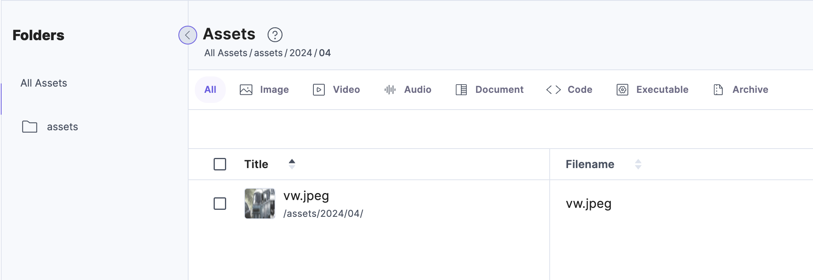
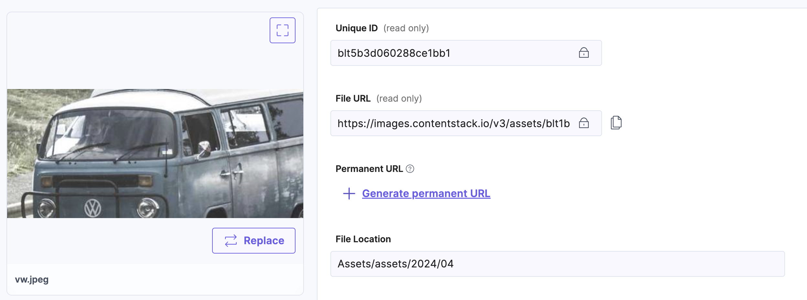
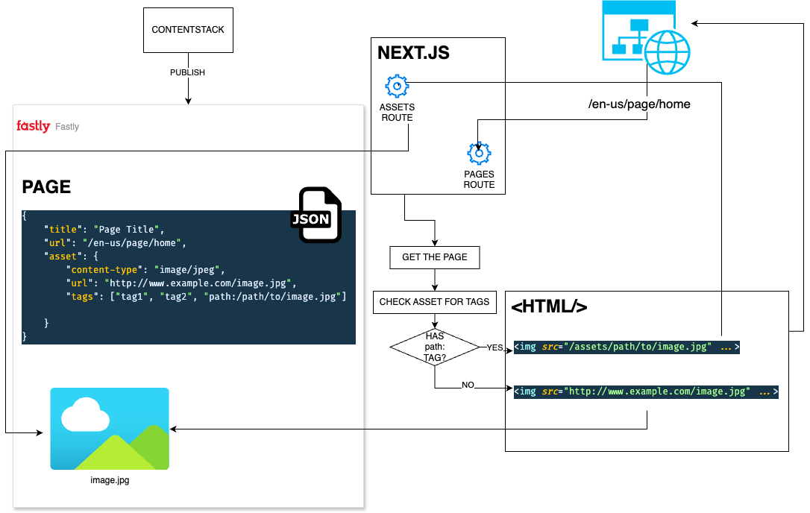

# Implementing Custom URLs for Assets

This readme describes how you can implement custom urls for your assets utilizing tags to store such a custom url. In this specific example we will use a folder-like url, but any url pattern can be used.

## Context

When managing assets in Contentstack, those can be organized in a folder structure. Upon asset upload and saving, the system generates a publicly accessible URL for each asset, which means that if you know such a URL, then you can access the asset on your browser.

When publishing the assets, Contentstack leverages that same publicly available URL to associate the asset with the different entries that might be referencing it, so the payload returned from the Content Delivery API will have such a URL.

This is an example of a folder structure for an asset, and its Public URL:

Next, we will describe how you can implement your own custom url pattern. For this document we will mimic the folder structure of the asset to generate the relative URL of the asset.

## Implementing Proxy to Handle Custom URLs

In order to support custom URLs for your Assets, you first need a service that is capable of handling such custom urls, but even before that you need to associate the Asset with that url, too. Keep in mind that at this point Contenstack doesn’t provide a way to query for assets based on a folder path, in fact, that’s what we are implementing here.

To associate the asset with a given folder-like path, we are gonna rely on tags and we are going to use a naming convention. Such naming convention for the tat is as follows:
Each tag will have the path: prefix.
After the prefix, we will manually enter the path (url) we want for the asset, e.g.: /assets/2003/09/vw.jpeg, please note that it’s the editor's responsibility to match the path with the folder structure. This tag association could be automated by using Automation Hub or webhook, that could automatically generate the tag based on the folder structure in which the asset is stored, but that process is outside of the scope of this document.

So with this premise, the asset would have a tag with the following value:

`path:/assets/2024/04/vw.jpeg`

Now that the asset has a tag associated with it, we can query for the asset with it. That’s what our proxy service will do. In this example, we are using a NextJS 13 route, which will intercept all the requests on a given slug (.i.e.: /images/*) and will intercept those requests and will return the appropriate asset, or 404 if the asset is not found.

So the route is available at:

And the code for the route, intercepts GET, requests that match the following pattern
`[lng]/assets/[...slug]`

Where `[lng]` represents the locale code, i.e. `en-us`, and where slug can be any url, such as `/assets/2024/04/vw.jpeg`.

Any request that hits the server and that matches that pattern will be handled by the route above. Next we describe how such requests are handled by the route code and how to leverage the Content Delivery API to retrieve assets based on a tag, which at the end of the day is the mechanism we decided to utilize in the first place.

Some of the requirements that need to be considered, is how the route would handle assets that are not found, and when the request returns more than one asset, in which case we need to determine which one we need to return, or alternatively, return an error. Our route implements the latter.

## SOLUTION ARCHITECTURE

